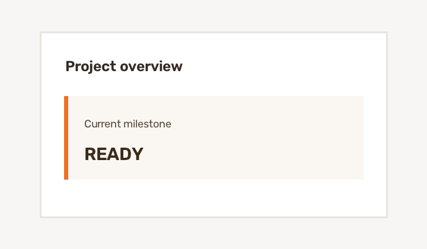
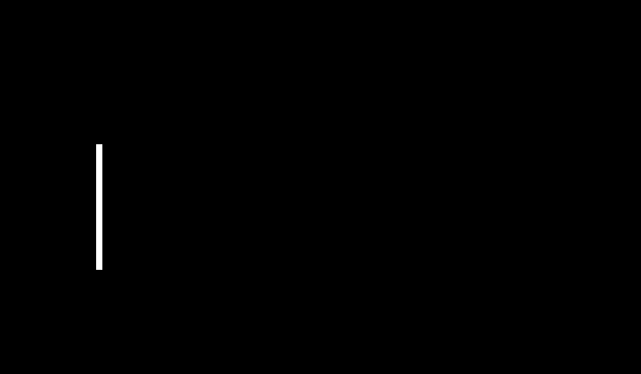
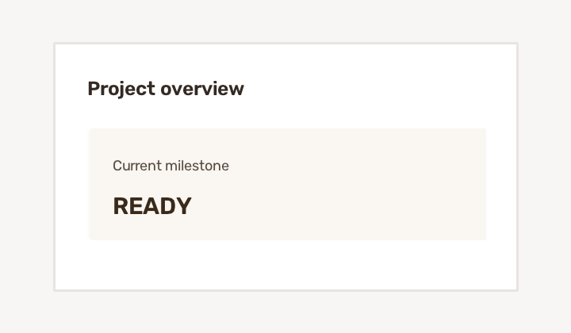

# The First Step to Making Your UI Look Less Vibe-Coded

Remove narrow, solid vertical accent bars from screenshots—without hard-coding their colour.

This small Python tool finds tall, thin, locally contrasting, colour-consistent shapes and reconstructs the pixels behind them. It is built for decorative bars inside cards, callouts, dashboards, and generated UI screenshots.

## Example

| Before | Detection mask | After |
| --- | --- | --- |
|  |  |  |

The example is generated and unbranded. No private or customer screenshot is included in this repository.

## Install

```bash
git clone https://github.com/shafiqhaniffa96-a11y/first-step-to-look-non-vibe-coded.git
cd first-step-to-look-non-vibe-coded
python -m pip install -e .
```

Python 3.10 or newer is required.

## Use the CLI

```bash
first-step-non-vibe screenshot.png \
  --output cleaned.png \
  --mask detected-mask.png
```

The mask is optional, but it shows the complete area that inpainting is allowed to change.

Tune detection when needed:

```bash
first-step-non-vibe screenshot.png -o cleaned.png \
  --min-height 40 \
  --max-width 20 \
  --sensitivity 24
```

- `--min-height` ignores short text-like marks.
- `--max-width` prevents broad panels from being removed.
- `--sensitivity` controls how different a bar must be from nearby pixels.

## Use the Python API

```python
import cv2
from first_step_non_vibe import DetectionConfig, remove_vertical_accents

image = cv2.imread("screenshot.png")
cleaned, mask = remove_vertical_accents(
    image,
    DetectionConfig(min_height=40, max_width=20, sensitivity=24),
)
cv2.imwrite("cleaned.png", cleaned)
cv2.imwrite("mask.png", mask)
```

`detect_vertical_accents(image, config)` is also available when you only need the mask.

## How it works

1. Compare each pixel with neighbours beyond the configured maximum bar width.
2. Join anti-aliased vertical sections.
3. Keep only narrow, tall, dense, colour-consistent components that separate two different nearby surfaces.
4. Expand the accepted mask by one pixel and reconstruct it with OpenCV Telea inpainting.

The geometry and local contrast drive detection, so orange, blue, grey, and other colours use the same pipeline.

## Limitations

- Designed for raster screenshots, not HTML or CSS source files.
- Complex textures behind a removed bar may not reconstruct perfectly.
- An isolated line on one uniform surface is ignored because it cannot be safely distinguished from a tall text stroke.
- Review the diagnostic mask before processing important assets in bulk.
- It intentionally does not remove arbitrary watermarks or text.

## Develop and contribute

```bash
python -m pip install -e ".[test]"
python -m pytest -v
python scripts/generate_examples.py
```

Issues and focused pull requests are welcome. Include a small synthetic reproduction for detection changes and add a failing test before the fix.

## License

[MIT](LICENSE) © 2026 Ahnaf Thaqeef
